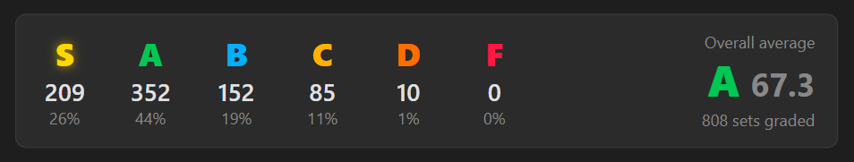

  

# Slippi Ranked Stats

A desktop app for tracking and analyzing your Slippi Ranked sets. Point it at your replay folder, scan, and get a full breakdown of your play — matchups, stages, sessions, rating history, and live session tracking.

  
    
  

---

## Features

- **Replay scanning** — scans your local Slippi folder and pulls in all your ranked sets
- **Matchup stats** — win rates vs every character you've played, sortable by best/worst
- **Stage stats** — see which stages you're winning and losing on
- **Session breakdown** — each play session grouped separately with a momentum chart
- **All-time stats** — overall win rate, comeback rate, deciding game win %, and more
- **Rating history** — track your rating over time with a set-by-set breakdown
- **Live session tracking** — monitor your current session's stats, NOW PLAYING card, and rating delta in real time (Premium)
- **Set grading** — every completed set scored across Neutral, Punish, Defense, and Execution against community baselines. Overall letter + strongest/weakest category are free; the full per-stat breakdown is Premium. See [how grading works](docs/grading_methodology.md).
- **Auto-updates** — notified in-app when a new version is available; installs in one click, no manual download needed

---

## Installation

1. Go to the [Releases](https://github.com/Joey-Farah/Slippi-Ranked-Stats/releases/latest) page
2. Download `Slippi Ranked Stats_x.x.x_x64-setup.exe`
3. Run the installer

Once installed, future updates will be delivered automatically — you'll see a banner inside the app when one is ready.

---

## Getting Started

1. Enter your **Connect Code** (e.g. `JOEY#870`)
2. Click **Browse…** and select your Slippi replay folder
   - Usually at `C:\Users\<you>\Documents\Slippi`
3. Click **Scan Replays**
4. Click **Get Current Rating** to pull your current Slippi rating

Your connect code and folder path are saved, so next time you open the app it'll pick up any new replays automatically.

---

## Requirements

- Windows 10 or later
- [Slippi](https://slippi.gg) with ranked replays saved locally

---

## Privacy & Security

Everything is stored locally on your machine. No gameplay data, replays, or personal information is ever uploaded or shared.

Updates are cryptographically signed — the app will only install an update that was signed with this project's private key. This means no one can push unauthorized code to your machine through the updater, even if the GitHub repository were ever compromised.

---

## Premium

Premium features are available to supporters on [Ko-fi](https://ko-fi.com/joeydonuts) or [Patreon](https://www.patreon.com/joeydonuts):

- **Live Session Tracking** — real-time per-game stats, NOW PLAYING card, and rating delta
- **Full Set Grade Breakdown** — per-category scores, per-stat values and scores, and matchup-specific baselines. (The overall grade + strongest/weakest category are free for everyone.)

After subscribing, click **Connect Discord** in the app to verify your supporter role.

---

## Support

If you get some use out of this, feel free to support the project:

[ko-fi.com/joeydonuts](https://ko-fi.com/joeydonuts) · [patreon.com/joeydonuts](https://www.patreon.com/joeydonuts)

---

## Issues

Found a bug or want to request a feature? [Open an issue](https://github.com/Joey-Farah/Slippi-Ranked-Stats/issues) or message me on Discord (joeydonuts).
